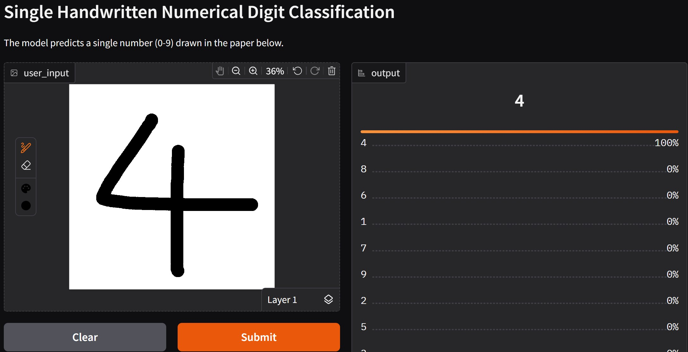

# Single Handwritten Numerical Digit Classification
Numerical image classification using Convolutional Neural Network, illustrating the complete machine learning pipeline with PyTorch.

## Overview
- Task: Numerical Image Classification (from 0 to 9)
- Model: Convolutional Neural Network (CNN)
- Challenges: Building a CNN model from scratch, training the model and implementing an interactive demonstration

## Demonstration
- A demonstration of the model is produced at HuggingFace Space: https://huggingface.co/spaces/Fuyuki0312/ModelDetectingNumber-demo
- You may need to restart the space in order to use the model.
- Note: Input images are grayscale and their background color should be white by default.

## How to use this model
- If you wish to continue to train the existing model, consider to run the `train.py` with both `ModelDetectingNumber.pth` and `model.py` in the same directory. Hyperparameters in `train.py` can be changed to suit your need. Besides, if you wish to train a completely new model, simply delete or move file `ModelDetectingNumber.pth` away. When `ModelDetectingNumber.pth` is not found, `train.py` will automatically initialize a new model with architecture based on `model.py`.
- The dataset, used for training, should be put in the same directory with `train.py` under a folder named `numbers`, with the following structure:  
`numbers`/  
├── 0/  
│   ├── img1.png  
│   ├── img2.png  
│   └── ...  
├── 1/  
│   ├── img1.png  
│   └── ...  
├── 2/  
├── 3/  
├── 4/  
├── 5/  
├── 6/  
├── 7/  
├── 8/  
└── 9/  
- Besides, if you only wish to use the model for inference, you can import model from `model.py` with weights loaded from `ModelDetectingNumber.pth`.

## Limitation
- Model usually gives right predictions only when the background color of input images is white because this model was trained primarily on numerical images with white backgrounds.
- If the input image is not so clear, the model may confidently produce a wrong prediction.

## Possible Improvements
- Expanding the dataset to include numerical images with diverse backgrounds (dark, textured, etc).
