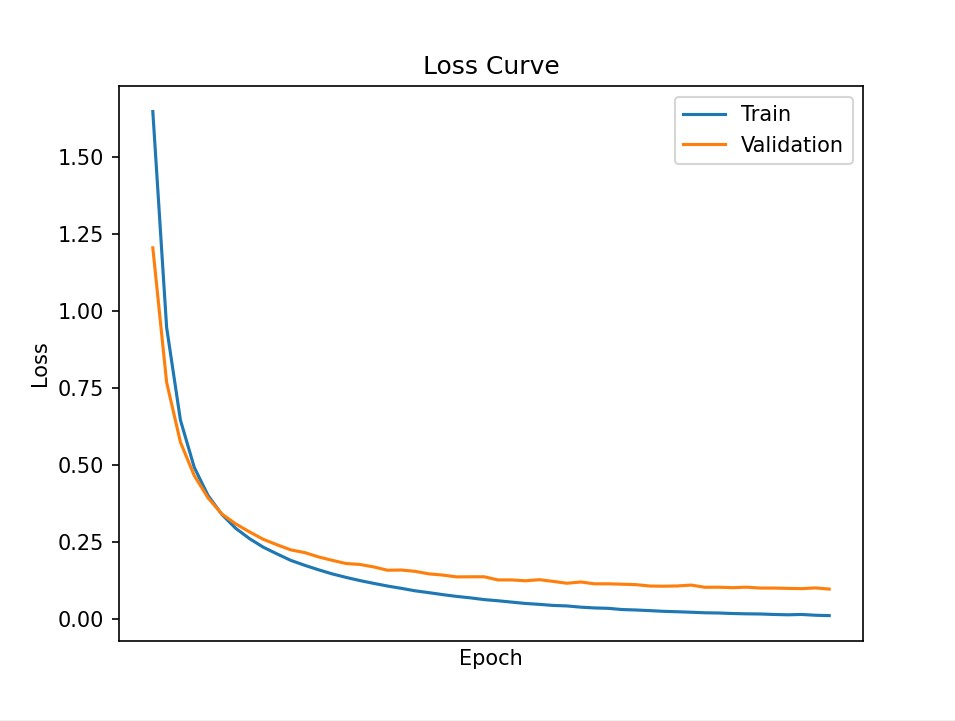
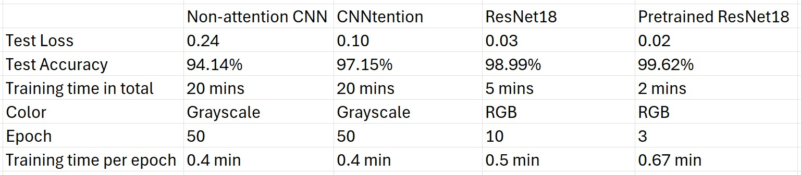

# Model Comparison In Handwritten Digit Classification  
A comparative study of attention-augmented Convolutional Neural Network (CNNtention) and ResNet18 for handwritten digit classification with detailed evaluation and analysis.

## 1. Overview
- Task: Comparing 4 models: a non-attention CNN model, two CNNtention models (trained on two different image sizes) and a ResNet18 model from scratch in handwritten digit classification (from 0 to 9)
- Model: Convolutional Neural Network (CNN)
- Mechanism: Spatial Self-Attention (inspired by Transformer)

## 2. Background

### 2.1. Inspiration
This project is inspired by the paper **"CNNtention: Can CNNs do better with Attention?"** (Glattki, Kapila & Rathi, 2024) [[arXiv:2412.11657](https://arxiv.org/html/2412.11657v1)].  
I adapt their approach of integrating self-attention mechanisms into CNN architectures for the task of handwritten digit classification on a custom dataset.  

### 2.2. Why choosing CNN
CNN models are a strong baseline in image classification because of their ability to learn local spacial features effectively, and perform sufficiently even with a small dataset.  

In contrast, Vision Transformer (ViT) models, while outperform CNN models thanks to global dependencies, require significantly more data and computational resources to train effectively.  

Given the limited size of the dataset in this project, CNN is considered a more suitable and practical choice. However, To improve performance and to inherit advantages of ViT, I built a attention-augmented CNN model.  

## 3. Dataset  

This project uses a custom dataset of handwritten digits (0–9).  
The original dataset: https://www.kaggle.com/datasets/olafkrastovski/handwritten-digits-0-9  
Total images: approximately 20000 images with 1886 images of label 9 and about 2100 images of other labels  

### 3.1. Data Cleaning  

The dataset was manually inspected and cleaned to improve quality:  

- Removed corrupted images or ones that can be hardly seen
- Filtered out images where digits are not clearly visible

### 3.2. Data Characteristics
- Image size: 90×140 (can be resized to 45x70 to reduce total training time of the CNNtention model)
- Includes variations in handwriting styles and stroke thickness
- There is a number of digits which are not centered and have various size
- Some digits are visually similar (e.g., 0, 6, 8, 9), which introduces ambiguity

### 3.3. Data Augmentation  
Some heavy transformations (e.g., random rotation, large scaling) were avoided to preserve digit structure. However, some transformations are available in `train.py` in commentary form, meaning that they can be enabled by deleting sharp symbols "#" based-on your needs. For more detailed, you can take a further look at `train.py`.

## 4. Demonstration
- A demonstration of the CNNtention model (45x70) from scratch is produced at HuggingFace Space: https://huggingface.co/spaces/Fuyuki0312/CNNtention-in-handwritten-digit-classification
- Or for the ResNet18 model: https://huggingface.co/spaces/Fuyuki0312/ResNet18-in-handwritten-digit-classification
- The Space may need a few seconds to restart if inactive. 
- Note: Input image's background color should be white by default.  
  

## 5. Metrics

### 5.1. Non-attention CNN model built from scratch
- The model reached 94.14% test accuracy.  

 
  

- The model sometimes confuses digits like 0, 3, 6, 8, and 9 due to similar rounded shapes and different handwritting styles.  

### 5.2. CNNtention

#### 5.2.1. CNNtention on images of size 90x140 (original size)
- This CNNtention model was built based on the non-attention CNN model's architecture but with attention mechanisms, reaching 96.97% test accuracy.

 
  

#### 5.2.2. CNNtention on images of size 45x90 (resized)

- Due to very long training time (section 5.4), I decided to train that CNNtention model again but with images resized to 45x70 from 90x140 and reached 97.15% test accuracy.  
  
 
  

- This 45x70 CNNtention model classifies nearly all labels more effectively compared to the Non-attention CNN model (section 5.1), though this CNNtention model still sometimes misclassifies 9 to 8. This may be due to the fact that the number of image 9 is smaller than the number of other images in the custom dataset (section 3) and the fact that images are resized to 45x70, reducing images' information four times.

### 5.3. ResNet18 from scratch
- The model reached 98.99% test accuracy.
 

 
- While the ResNet18 model performed effectively on the dataset with reliable metrics, it may not necessarily be consistent to correctly predict real-world handwritten digits. Therefore, these metrics should be interpreted with caution.

### 5.4. Comparison

- Thanks to residual architecture and a lot more layers and parameters, the ResNet18 model resulted in a considerably high test accuracy, being 98.99%, without the need of transforming data into grayscale. Similarly, the non-pretrained ResNet18 model shows reliable metrics with slightly increased total training time.
- The non-attention CNN model built from scratch, on the other hand, reached an acceptable test accuracy (94.14%), yet demanded many times more epochs (50 epochs), leading to longer training time. After data had been transformed into grayscale, this model was trained with a speed of roughly 0.4 min/epoch, achieving about 94% test accuracy.
- Regarding the CNNtention model, this model's metrics also surpass the non-attention CNN model's ones, reaching remarkably higher test accuracy (97.15%), but still lower than the ResNet18 models' test accuracy. This gap, however, does not diminish the CNNtention model compared to ResNet18 models, but illustrates a trade-off. Built based-on a simple architecture of the non-attention CNN model where there are not many parameters, the CNNtention model requires much fewer computational resources and has its weights stored in `ModelDetectingNumber.pth` with a much smaller size. Particularly, its model weights are stored in a much smaller file: the CNNtention's `ModelDetectingNumber.pth` is only 987 KB, whereas the ResNet18 models' file size is 131,169 KB.  

**Key Advantages of CNNtention compared to ResNet18 and non-attention CNN:**  
- **Significantly smaller** weight size (987 KB vs 131,169 KB)
- **3% accuracy improvement** over baseline CNN
- **Lower computational requirements** - suitable for low-end devices

## 6. How to use the models
Note: before following the instruction below, you may want to go to folder `CNNtention` or `ScratchResNet18` or others first.

### 6.1. Training
- To continue to train the existing models, consider to run `train.py`. Hyperparameters in those files can be changed to suit your need. Besides, if you want to train a completely new model, simply delete or move `ModelDetectingNumber.pth` away. When `ModelDetectingNumber.pth` is not found, `train.py` will automatically initialize a new model based on `model.py` (and `self_attention.py` for CNNtention).
- The dataset, used for training and plotting confusion matrix, should be put in the same directory with `train.py` under a folder named `numbers`, with the following structure:  
`numbers`/  
├── 0/  
│   ├── `img1.png`  
│   ├── `img2.png`  
│   └── ...  
├── 1/  
│   ├── `img1.png`  
│   └── ...  
├── 2/  
├── 3/  
├── 4/  
├── 5/  
├── 6/  
├── 7/  
├── 8/  
└── 9/

### 6.2. Inference
- If you want to use the models for inference only, you can import the models from `model.py` (and also `self_attention.py` for CNNtention) with weights loaded from `ModelDetectingNumber.pth`.
- Besides, `PlotConfusionMatrix.py` can be used to plot confusion matrix for the current model with weights loaded from `ModelDetectingNumber.pth` on the dataset.  

## 7. Limitation and Possible Improvements

### 7.1. Limitation
- The models usually give right predictions only when the background color of input images is white because the models were trained primarily on numerical images with white backgrounds.
- When the input image is ambiguous or low-quality, the models may confidently produce an incorrect prediction.
- Digits that occupy only a small portion of the image are more likely to be misclassified.

### 7.2. Possible Improvements
- Expanding the dataset to include numerical images with diverse backgrounds (dark, textured, etc) might enable models to predict images with black background and white digits.
- Since some digits have more than one handwritting style, adding more numerical images written in a wider range of styles to the dataset can help models become more familiar with human-like digits.
- Rescaling data into smaller sizes may help models to recognize digits especially when written digits are very small.
